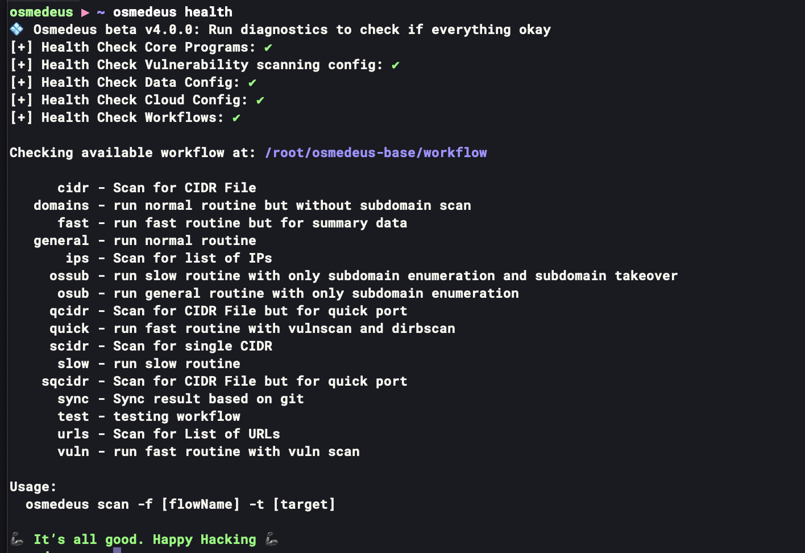

# :material-play: Installation

!!! info "[Follow this link to see a video instruction](https://www.youtube.com/playlist?list=PLiifzv5MjIo3JqKeG5EXbSKDBlqa7v14P)"

!!! tip "[Follow here to understand more about the structure of Osmedeus](/structure/#what-contains-in-a-osmedeus-release-package)"

## Install from a build release

Make sure you login as **root** otherwise run `sudo su` first then put `build-osm.zip` to any folder (e.g: `/opt/`)

```bash
unzip build-osm.zip && cd build-osm
./build.sh

# verify your installation with health command
osmedeus health
```

---

## Install from a base repository

You will need some essential tools like `wget, git, zip, tmux` first.

```shell
git clone --depth=1 git@gitlab.com:j3ssie/osmedeus-base.git ~/osmedeus-base
cd ~/osmedeus-base
./install.sh
```

## Verify the installation process

Just run the command `osmedeus health`. If you see the content like a image below then it's mean the installation process has been success.

{ loading=lazy }

!!! info "The installation process is still success if you see this message. It's just one of many :diamonds: Premium features :diamonds:"

    `[-] Cloud config setup incorrectly. If you install osmedeus on a single machine then it's okay to ignore the cloud setup`

