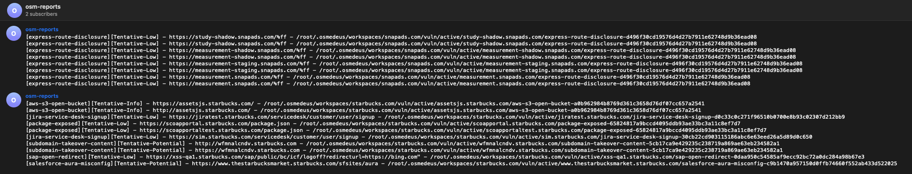
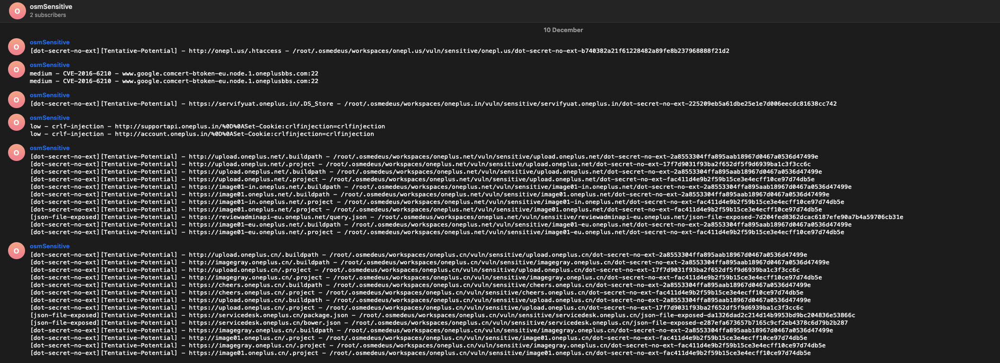

!!! help ""
    Note that this setup is **Optional**. You can still use the tool perfectly fine without it!


There are some places that tokens will store in Osmedeus below

### Main token file

By default all main tokens will be store at `~/osmedeus-base/private-alias.rc`

There some essential tokens in the token file. 
    - The Github token is needed for github search.
    - All the `TELEGRAM_` is for notification.

```shell
# Set github token for run github scan
export GITHUB_TOKEN=xxx,xxxx

# for telegram
export TELEGRAM_API_TOKEN=1111114500:AAGx
## use this command to get channel ID
## curl 'https://api.telegram.org/bot$TELEGRAM_API_TOKEN/sendMessage?chat_id=@osmpReports&text=hello'
export TELEGRAM_CHANNEL=-100XXXXX
export TELEGRAM_STATUS_CHANNEL=-100XXXXX
export TELEGRAM_REPORT_CHANNEL=-100XXXXX
export TELEGRAM_SENSITIVE_CHANNEL=-100XXXXX
export TELEGRAM_DIRB_CHANNEL=-100XXXXX
export TELEGRAM_MICS_CHANNEL=-100XXXXX

```

After modified the tokens, then run commands below to reload token to the osmedeus config.yaml

```shell
# or edit file private-alias.rc
# add osmedeus-base/private-alias.rc to your ~/.bashrc file
echo 'source $HOME/osmedeus-base/private-alias.rc' >> ~/.bashrc && source ~/.bashrc

# reload config to osmedeus
osmedeus config reload
```

### Amass config 

By Default Amass config will be store at `~/osmedeus-base/data/configs/amass.ini`


***

## Notification

!!! help ""
    Note that this setup is **Optional**. You can still use the tool perfectly fine without it!

## Notification with Telegram

{ loading=lazy }

{ loading=lazy }

You can setup telegram tokens at **[Setup Token & API Key](/installation/token/#main-token-file)**

***

## Setup Storages


!!! help ""
    Note that this setup is **Optional**. You can still use the tool perfectly fine without it!

### Follow **[this video](https://youtube.com/playlist?list=PLiifzv5MjIo3JqKeG5EXbSKDBlqa7v14P)** for more detail.

All of your storages setup will be store at `~/osmedeus-base/storages-alias.rc`

### Modify the content of Storages Config file

Create your SSH key and add to a user have access to all of the repos below. Save that key as `~/.osmedeus/secret_key.private`

```shell
# for storages
export SECRET_KEY=~/.osmedeus/secret_key.private
# core one
export SUMMARY_REPO=git@gitlab.com:not-j3ssie/your-osmd-summary
export VULN_REPO=git@gitlab.com:not-j3ssie/your-osmd-vuln
export PATHS_REPO=git@gitlab.com:not-j3ssie/your-osmd-paths
export HTTP_REPO=git@gitlab.com:not-j3ssie/your-osmd-http

# mics one
export ASSETS_REPO=git@gitlab.com:not-j3ssie/your-osmd-assets
export PORTS_REPO=git@gitlab.com:not-j3ssie/your-osmd-ports
export SUBDOMAIN_REPO=git@gitlab.com:not-j3ssie/your-osmd-subdomain
```

!!! info "Please change your username and repository name"

    Note that `not-j3ssie` is your gitlab username and `your-osmd-summary` is your Gitlab repo name.

!!! warning "Run these commands below if you not using git before"

    ```shell
    git config --global user.name "your_gitlab_user"
    git config --global user.email "your_gitlab_uid@users.noreply.gitlab.com"
    ```

***

### Load the storages variables to Osmedeus config


```shell

# or edit file storages-alias.rc
# add osmedeus-base/storages-alias.rc to your ~/.bashrc file
echo 'source $HOME/osmedeus-base/storages-alias.rc' >> ~/.bashrc && source ~/.bashrc

# reload config to osmedeus
osmedeus config reload

# finally you can check the content of ~/.osmedeus/config.yaml file
# to see if config actually change or not like below
cat ~/.osmedeus/config.yaml

# The content should be showed like this
# ...
# storages:
# ...
#   summary_repo: git@gitlab.com:j3ssie/dosm-summary
#   summary_storage: ~/.osmedeus/storages/summary
# ...

# now run the health check again it will clone the 
osmedeus health


# then check out your storages folder at `~/.osmedeus/storages`
ls ~/.osmedeus/storages/summary/ 

```
