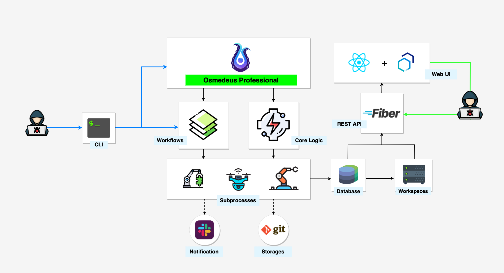
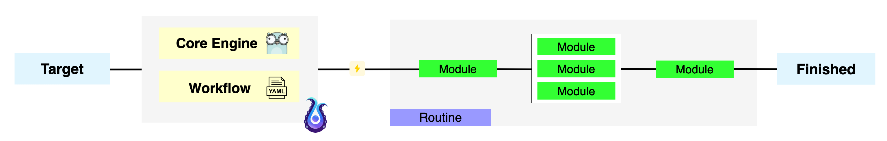
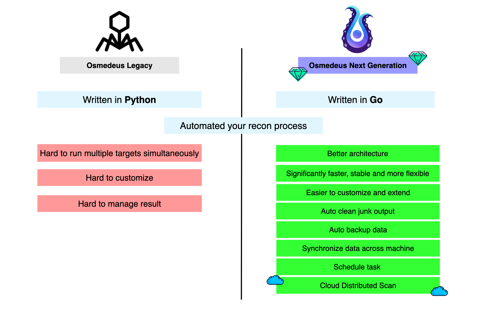

# :fontawesome-brands-codepen: Architecture

{ loading=lazy }

## The structure of the Osmedeus

{ loading=lazy }

The tool has two main components:

- [x] **Core Engine** written in Golang that is responsible for handling all the logic and a 
- [x] **Workflow** which is a collection of YAML files that describe your methodology

**Target** can be domain, url, IP, CIDR or anything that fit your workflow.

## Comparison to the old version

{ loading=lazy }

## How does Osmedeus actually work?

Osmedeus will take your input along with the selected flow/module to create a routine that contains a list of commands and logic to complete the scan.

Behind the scene, it actually runs [other 3rd party tools](/workflow/default-workflow/) with special logic generated by Osmedeus core.