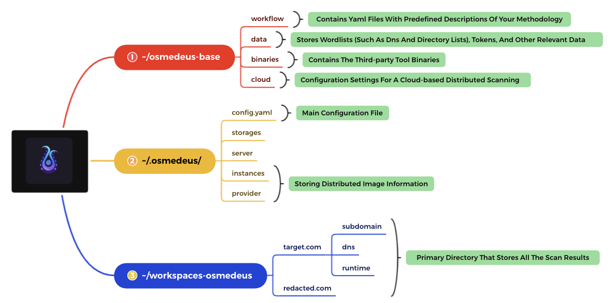

# :fontawesome-brands-codepen: Architecture

{ loading=lazy }

## Manifest

The main philosophy of **Osmedeus** was never meant to be the that replace your tools or any other tools.
It was designed to build a foundation with the capability and flexibility that allow you to make your recon system faster, cleaner and much more powerful.

## The structure of the Osmedeus

{ loading=lazy }

The tool has two main components:

- [x] **The Core Engine**, written in Golang, is responsible for handling complex logic and providing a range of built-in utilities to make running your workflow more efficient. It is a key component that helps to streamline and simplify the process.
- [x] **A Workflow** is a set of YAML files that outline your methodology. It is a way to organize and document the steps involved in a process or task.

**Target** can be domain, url, IP, CIDR or anything that fit your workflow.

## Comparison to the old version

{ loading=lazy }

## How does Osmedeus actually work?

Osmedeus will take your input along with the selected flow/module to create a routine that contains a list of commands and logic to complete the scan.

Behind the scene, it actually runs [**other 3rd party tools**](/workflow/default-workflow/) with a special logic generated by Osmedeus core.

## Detailed overview of the structure of the Osmedeus Engine

{ loading=lazy }