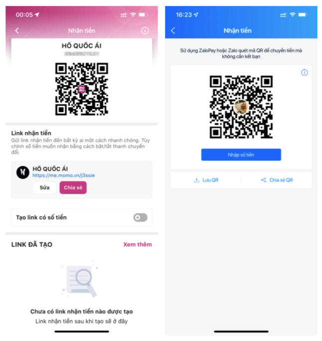

# :blue_heart: Donation 

If you love my tools and would like to support my work, please check out some donation methods below to get a [**premium package**](/premium/).

## :large_orange_diamond: Sponsor

If you or your organization are interested in sponsoring my projects or displaying your logo on the project documentation page, please reach out to me through the contact information **[:material-twitter: here](https://twitter.com/OsmedeusEngine)**

## For Everyone 

[](https://paypal.me/j3ssiejjj)  

<a href="https://patreon.com/j3ssie"></a>   
 
<a href='https://ko-fi.com/j3ssie' target='_blank'>

***

**[Become a backer on opencollective](https://opencollective.com/osmedeus)** and you will appear here.
[](https://opencollective.com/osmedeus#backers)

## For Crypto Fan

```
BTC (BTC): 13ErAZgB94ySq4d5yC1gjDfZEVXcqT3769
BNB (BEP20): 0x15F2C20F30Ee89c61A2f46cD726910a27E359a2F
BTC (ERC20): 0x055ff71344bcff0362c0eaf887439a73885da458
ETH (ERC20): 0x15F2C20F30Ee89c61A2f46cD726910a27E359a2F
CRO (Cronos): 0x15F2C20F30Ee89c61A2f46cD726910a27E359a2F
MATIC (Polygon): 0x15F2C20F30Ee89c61A2f46cD726910a27E359a2F
FTM (Fantom): 0x15F2C20F30Ee89c61A2f46cD726910a27E359a2F
AVAX (AVAX C-Chain): 0x15F2C20F30Ee89c61A2f46cD726910a27E359a2F
CRO (Cronos): 0x8241C6F30c7D76eBC2251d770B1671dbDC9d215E
USDT (BEP20): 0xaFC10B8064fDD47D04F1bFd8E6Ab59334711cAE6
USDT (ERC20): 0x15F2C20F30Ee89c61A2f46cD726910a27E359a2F
USDC (ERC20): 0x055ff71344bcff0362c0eaf887439a73885da458
USDC (Solana): 73XybrFZN5HixnPvgT7YG3r7tVWh2rKZVmNZGuZPFJwi
SOL (Solana): 6w4kMFhS61VGVvgxW29sdC3jnzbAFpP2Cpcd4UJXVSZc
```

## For People in My local country

<figure markdown> 
    
</figure>


