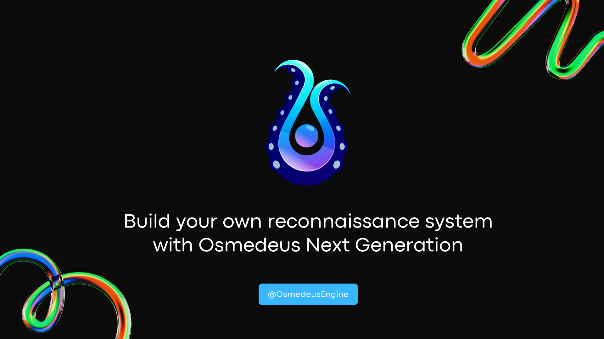

# :octicons-light-bulb-16: Introduction

<figure markdown> 
  
</figure>

!!! note "[The Introduction Presentation can be found here](https://docs.google.com/presentation/d/1Mu6JqzIpLiPbwXtPraFJRNBCAu5OXZn4SMIcl8hvMWI/edit#slide=id.gadf93641a2_2_75)"

## What is Osmedeus?
**Osmedeus** is a Workflow Engine for Offensive Security. It was designed to build a foundation with the capability and flexibility that allow you to automatic run your reconnaissance methodology on a large number of targets.

## Showcases

The Engine has successfully found a tremendous number of security vulnerabilities in many big companies out there with **:fire: [My reconnaissance methodology](/premium/#my-methodology) :fire:**

{ loading=lazy }

## Gettting Started

!!! info "[Click here to know how to Installation Osmedeus](/installation/)"

!!! question "[Learn more about the Architecture of Osmedeus](/architecture/)"

!!! example "[Demo Video can be found here](https://www.youtube.com/playlist?list=PLiifzv5MjIo3JqKeG5EXbSKDBlqa7v14P)"

## Features

:rocket: Significantly speed up your recon process  
:white_check_mark: Organize your scan results   
:white_check_mark: Efficiently to customize and optimize your recon process   
:white_check_mark: Seamlessly integrate with new public and private tools   
:white_check_mark: Easy to scale across large number of targets   
:white_check_mark: Easy to synchronize the results across many places   
