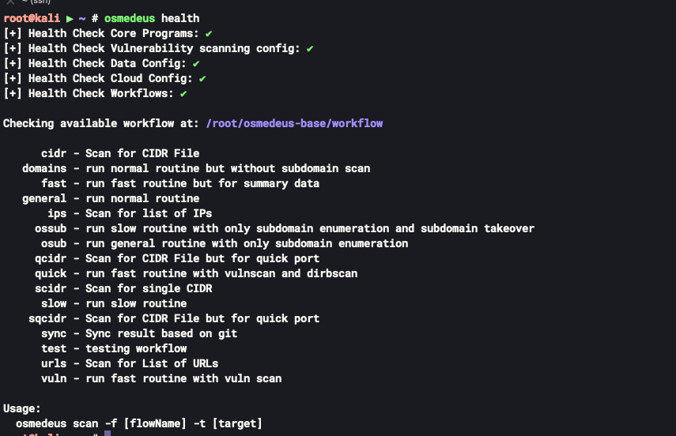

# :material-play: Installation

!!! info "[Follow this link to see a video instruction](https://www.youtube.com/playlist?list=PLiifzv5MjIo3JqKeG5EXbSKDBlqa7v14P)"


## :fontawesome-brands-linux: Install from a base repository

!!! warning ""
    **NOTE** that you need some essential tools like `curl, wget, git, zip, tmux` and login as **root** to start

```shell

bash -c "$(curl -fsSL https://raw.githubusercontent.com/osmedeus/osmedeus-base/master/install.sh)"
```

***


## :material-apple: Install for MacOS (experimental)

!!! warning ""
    **NOTE** that you need to install **[homebrew](https://brew.sh/)** first.

```shell
bash -c "$(curl -fsSL https://raw.githubusercontent.com/osmedeus/osmedeus-base/master/install-macos.sh)"
```

**[Some other changes](installation/install-note/#when-install-on-macos)** you might need to make if you really want to use Osmedeus on MacOS

***

## :package: Install from a build release

Make sure you login as **root** otherwise run `sudo su` first then put `build-osm.zip` to any folder (e.g: `/opt/`)

```bash
unzip -q build-osm.zip && cd build-osm
./build.sh

# verify your installation with health command
osmedeus health
```


## :material-docker: Using Docker

```shell
docker run -it j3ssie/osmedeus:latest scan -t example.com
```


***

## :heavy_check_mark: Verify the installation process

Just run the command `osmedeus health`. If you see the content like a image below then it's mean the installation process has been success.

{ loading=lazy }

!!! info "The installation process is still success if you see this message. It's just one of many :diamonds: Premium features :diamonds:"

    `[-] Cloud config setup incorrectly. If you install osmedeus on a single machine then it's okay to ignore the cloud setup`

