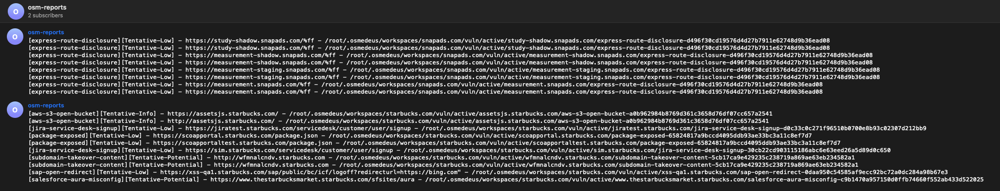
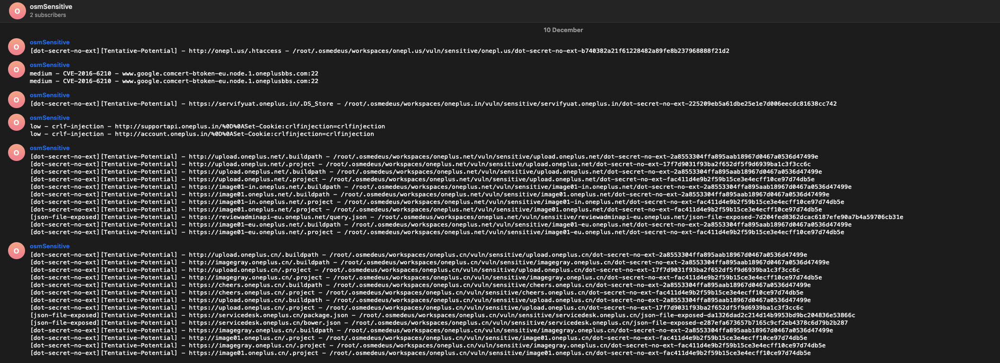

!!! help ""
    Note that this setup is **Optional**. You can still use the tool perfectly fine without it!


!!! warning ""
    You should only store your token in the `osm-default.rc` file. Modify the `~/.osmedeus/config.yaml` will work but you will lose your token when running the config reload.


There are some places that tokens will store in Osmedeus below

### Main token file

By default all main tokens will be store at `~/osmedeus-base/token/osm-default.rc`

There some essential tokens in the token file. 
    - The Github token is needed for github search.
    - All the `TELEGRAM_` is for notification.

```shell
# Set github token for run github scan
export GITHUB_TOKEN=xxx,xxxx

# for telegram
export TELEGRAM_API_TOKEN=1111114500:AAGx
## use this command to get channel ID
## curl 'https://api.telegram.org/bot$TELEGRAM_API_TOKEN/sendMessage?chat_id=@osmpReports&text=hello'
export TELEGRAM_CHANNEL=-100XXXXX
export TELEGRAM_STATUS_CHANNEL=-100XXXXX
export TELEGRAM_REPORT_CHANNEL=-100XXXXX
export TELEGRAM_SENSITIVE_CHANNEL=-100XXXXX
export TELEGRAM_DIRB_CHANNEL=-100XXXXX
export TELEGRAM_MICS_CHANNEL=-100XXXXX

```

After modified the tokens, then run commands below to reload token to the osmedeus config.yaml

```shell
# or edit file osm-default.rc
# add osmedeus-base/token/osm-default.rc to your ~/.bashrc file
echo 'source $HOME/osmedeus-base/token/osm-default.rc' >> ~/.bashrc && source ~/.bashrc

# reload config to osmedeus
osmedeus config reload
```

### Amass config 

By Default Amass config will be store at `~/osmedeus-base/data/configs/amass.ini`


***

## Notification

!!! help ""
    Note that this setup is **Optional**. You can still use the tool perfectly fine without it!

## Notification with Telegram

Follow [**this guide**](https://core.telegram.org/bots/faq#how-do-i-create-a-bot) to generate your API token and put it to the `~/osmedeus-base/token/osm-default.rc`.
Then reload your config with the command `osmedeus config reload` to load the API key.

{ loading=lazy }

{ loading=lazy }

You can now using **[Notification Scripts](/workflow/noti-scripts/)** in your Workflow. 

***

You can search `TeleMessByFile` script in the workflow which will send the message as the content of a file to a specific channel.

```yaml

# Content of the file `~/osmedeus-base/token/osm-default.rc` is represent for specific channel name as below
export TELEGRAM_CHANNEL=-100XXXXX           --> #general
export TELEGRAM_STATUS_CHANNEL=-100XXXXX    --> #status
export TELEGRAM_REPORT_CHANNEL=-100XXXXX    --> #report
export TELEGRAM_SENSITIVE_CHANNEL=-100XXXXX --> #sensitive
export TELEGRAM_DIRB_CHANNEL=-100XXXXX      --> #dirb
export TELEGRAM_MICS_CHANNEL=-100XXXXX      --> #mics

# this will send the file '{{.Output}}/vuln/sensitive/sensitivescan-{{.Workspace}}-{{.TS}}.txt' to the channel TELEGRAM_SENSITIVE_CHANNEL above
- TeleMessByFile("#sensitive", "{{.Output}}/vuln/sensitive/sensitivescan-{{.Workspace}}-{{.TS}}.txt")


# this will send the file 'Start the scan {{.Target}}' to the channel TELEGRAM_MICS_CHANNEL above 
- TeleMess("#mics", "Start the scan {{.Target}}")

```
