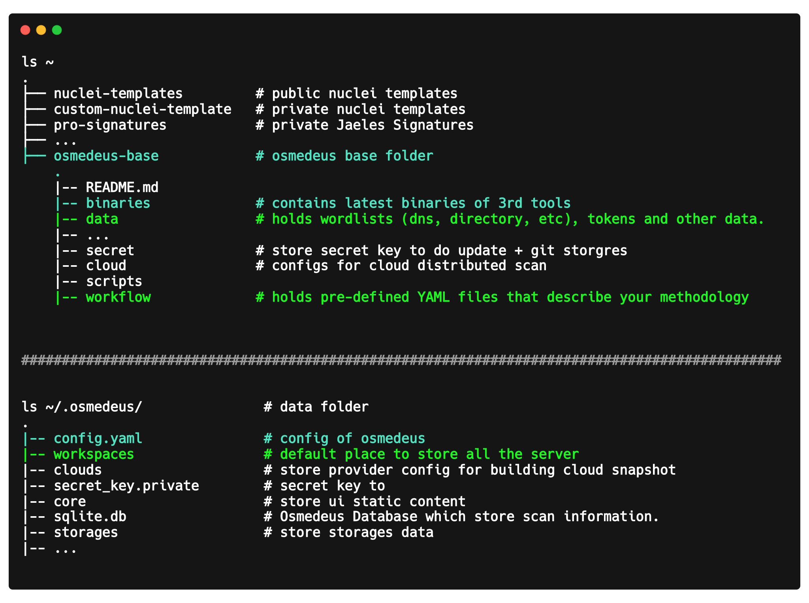
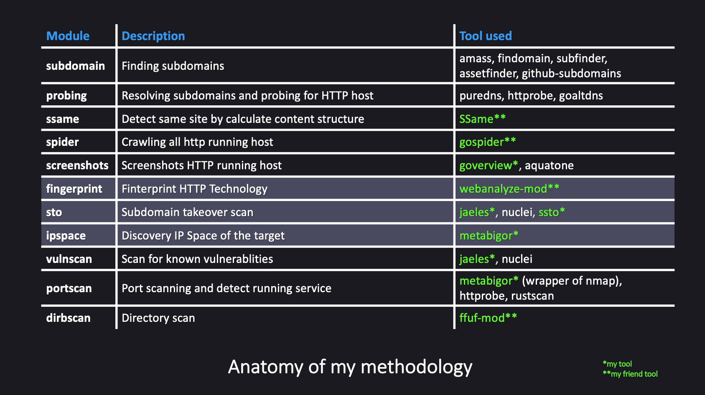
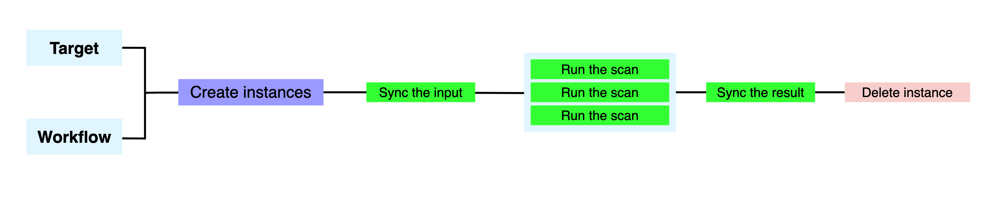
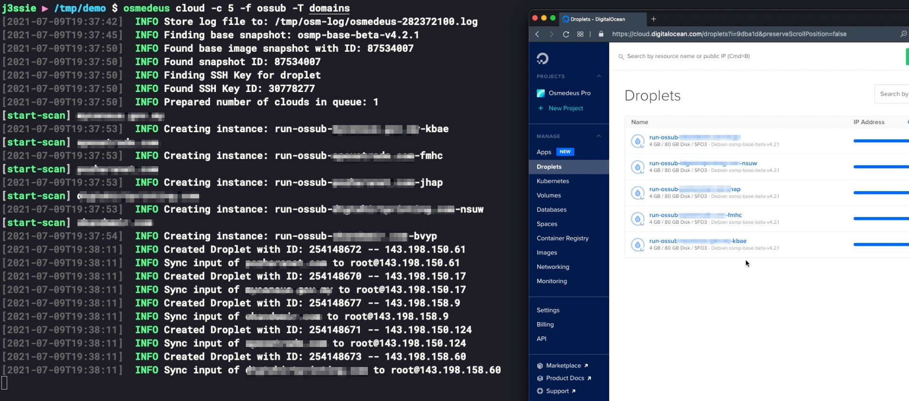

# :diamond_shape_with_a_dot_inside: What is Premium Package?

!!! tip ":material-diamond: How much does it cost?"

    You can start to join my **[Patreon](https://patreon.com/j3ssie)** starting at :heartpulse: **[5$ / month](https://patreon.com/j3ssie)** :heartpulse: to see a [private post](https://www.patreon.com/posts/60580071) contains a installation guide for the Premium package

    You can choose some  **[:small_blue_diamond: donation methods here :small_blue_diamond:](/donation/)** to get the premium package with minimum **5$**

## What will you get?

- [x] My **[private workflow](#my-methodology)** which is fully tested on many site.
- [x] Wordlists that I collected from many sources for a long time.
- [x] Private third-party tools made the result a lot more accurate.
- [x] My Private Jaeles Signatures.

{ loading=lazy }

## My methodology

{ loading=lazy }

## Git Storages natively supported

Even though you can use Git Storages by writing your workflow. The premium workflow also comes with the storages script. All you need to do is set up your [Gitlab repository](/premium/git-setup/).

## Support Distributed Scan

{ loading=lazy }

{ loading=lazy }

