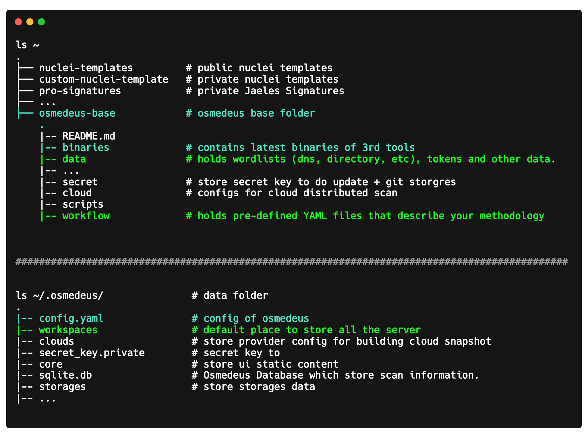

# Detail Structure of the tool

## Folders that Osmedeus will store data into ([source](https://carbon.now.sh/?bg=rgba%2846%2C46%2C55%2C0%29&t=theme%3Ahnpc0hr4yst&wt=none&l=auto&ds=false&dsyoff=18px&dsblur=68px&wc=true&wa=true&pv=17px&ph=11px&ln=false&fl=1&fm=Hack&fs=17px&lh=117%25&si=false&es=2x&wm=false&code=ls%2520%7E%250A.%2520%2520%2520%2520%2520%2520%2520%2520%2520%2520%2520%2520%2520%2520%2520%2520%2520%2520%2520%2520%2520%2520%2520%2520%2520%2520%2520%2520%2520%2520%2520%2520%2520%2520%2520%2520%2520%2520%2520%2520%2520%2520%2520%2520%2520%2520%2520%2520%2520%2520%2520%2520%250A%25E2%2594%259C%25E2%2594%2580%25E2%2594%2580%2520nuclei-templates%2520%2520%2520%2520%2520%2520%2520%2520%2520%2523%2520public%2520nuclei%2520templates%2520%2520%2520%250A%25E2%2594%259C%25E2%2594%2580%25E2%2594%2580%2520custom-nuclei-template%2520%2520%2520%2523%2520private%2520nuclei%2520templates%2520%2520%2520%250A%25E2%2594%259C%25E2%2594%2580%25E2%2594%2580%2520pro-signatures%2520%2520%2520%2520%2520%2520%2520%2520%2520%2520%2520%2523%2520private%2520Jaeles%2520Signatures%2520%2520%2520%2520%2520%2520%2520%2520%2520%2520%2520%2520%2520%2520%2520%2520%2520%2520%2520%2520%2520%2520%2520%2520%2520%2520%2520%2520%2520%2520%2520%2520%2520%2520%2520%2520%2520%2520%2520%250A%25E2%2594%259C%25E2%2594%2580%25E2%2594%2580%2520...%250A%25E2%2594%259C%25E2%2594%2580%25E2%2594%2580%2520osmedeus-base%2520%2520%2520%2520%2520%2520%2520%2520%2520%2520%2520%2520%2523%2520osmedeus%2520base%2520folder%2520%2520%2520%2520%2520%2520%2520%2520%2520%2520%2520%2520%2520%2520%2520%2520%2520%2520%2520%2520%2520%2520%2520%2520%2520%2520%2520%2520%2520%2520%2520%2520%2520%2520%2520%2520%2520%2520%2520%2520%2520%2520%2520%2520%2520%2520%2520.%250A%2520%2520%2509%257C--%2520README.md%2520%2520%2520%2520%2520%2520%2520%2520%2520%2520%2520%2520%2520%2520%2520%250A%2520%2520%2509%257C--%2520binaries%2520%2520%2520%2520%2520%2520%2520%2520%2520%2520%2520%2520%2520%2523%2520contains%2520latest%2520binaries%2520of%25203rd%2520tools%2520%250A%2520%2520%2509%257C--%2520data%2520%2520%2520%2520%2520%2520%2520%2520%2520%2520%2520%2520%2520%2520%2520%2520%2520%2523%2520holds%2520wordlists%2520%28dns%252C%2520directory%252C%2520etc%29%252C%2520tokens%2520and%2520other%2520data.%2520%2520%2520%250A%2520%2520%2520%2520%257C--%2520...%2520%2520%2520%2520%2520%2520%2520%2520%2520%2520%2520%2520%2520%2520%2520%2520%2520%2520%2520%2520%2520%250A%2520%2520%2509%257C--%2520secret%2520%2520%2520%2520%2520%2520%2520%2520%2520%2520%2520%2520%2520%2520%2520%2523%2520store%2520secret%2520key%2520to%2520do%2520update%2520%252B%2520git%2520storgres%250A%2520%2520%2509%257C--%2520cloud%2520%2520%2520%2520%2520%2520%2520%2520%2520%2520%2520%2520%2520%2520%2520%2520%2523%2520configs%2520for%2520cloud%2520distributed%2520scan%250A%2520%2520%2509%257C--%2520scripts%2520%2520%2520%2520%2520%2520%2520%2520%2520%2520%2520%2520%2520%2520%250A%2520%2520%2509%257C--%2520workflow%2520%2520%2520%2520%2520%2520%2520%2520%2520%2520%2520%2520%2520%2523%2520holds%2520pre-defined%2520YAML%2520files%2520that%2520describe%2520your%2520methodology%2520%250A%250A%250A%2520%2520%2520%2523%2523%2523%2523%2523%2523%2523%2523%2523%2523%2523%2523%2523%2523%2523%2523%2523%2523%2523%2523%2523%2523%2523%2523%2523%2523%2523%2523%2523%2523%2523%2523%2523%2523%2523%2523%2523%2523%2523%2523%2523%2523%2523%2523%2523%2523%2523%2523%2523%2523%2523%2523%2523%2523%2523%2523%2523%2523%2523%2523%2523%2523%2523%2523%2523%2523%2523%2523%2523%2523%2523%2523%2523%2523%2523%2523%2523%2523%2523%2523%2523%2523%2523%2523%2523%2523%2523%2523%2523%2523%2523%2523%2523%2523%250A%250A%250Als%2520%7E%252F.osmedeus%252F%2520%2520%2520%2520%2520%2520%2520%2520%2520%2520%2520%2520%2520%2520%2520%2523%2520data%2520folder%250A.%250A%257C--%2520config.yaml%2520%2520%2520%2520%2520%2520%2520%2520%2520%2520%2520%2520%2520%2520%2520%2523%2520config%2520of%2520osmedeus%2520%2520%2520%2520%250A%257C--%2520workspaces%2520%2520%2520%2520%2520%2520%2520%2520%2520%2520%2520%2520%2520%2520%2520%2520%2523%2520default%2520place%2520to%2520store%2520all%2520the%2520server%2520%2520%2520%250A%257C--%2520clouds%2520%2520%2520%2520%2520%2520%2520%2520%2520%2520%2520%2520%2520%2520%2520%2520%2520%2520%2520%2520%2523%2520store%2520provider%2520config%2520for%2520building%2520cloud%2520snapshot%250A%257C--%2520secret_key.private%2520%2520%2520%2520%2520%2520%2520%2520%2523%2520secret%2520key%2520to%2520%2520%2520%2520%2520%250A%257C--%2520core%2520%2520%2520%2520%2520%2520%2520%2520%2520%2520%2520%2520%2520%2520%2520%2520%2520%2520%2520%2520%2520%2520%2523%2520store%2520ui%2520static%2520content%250A%257C--%2520sqlite.db%2520%2520%2520%2520%2520%2520%2520%2520%2520%2520%2520%2520%2520%2520%2520%2520%2520%2523%2520Osmedeus%2520Database%2520which%2520store%2520scan%2520information.%250A%257C--%2520storages%2520%2520%2520%2520%2520%2520%2520%2520%2520%2520%2520%2520%2520%2520%2520%2520%2520%2520%2523%2520store%2520storages%2520data%250A%257C--%2520...%2520%250A%2520%2520%2520%2520%2520%2520%2520%2520%2520%2520%2520%2520%2520%2520%2520%2520%2520%2520%2520%2520%2520%2520%2520%2520%2520%2520%2520%2520%2520%2520%2520%2520%2520%2520%2520%2520%2520%2520%2520%2520%2520%2520%2520%2520%2520%2520%2520%2520%2520%2520%2520%2520%2520%2520%2520%2520%2520%2520%2520%2520%2520%2520%2520%2520%2520%2520%2520%2520%2520%2520%2520))

{ loading=lazy }

## What contains in a Osmedeus release package?

{ loading=lazy }
