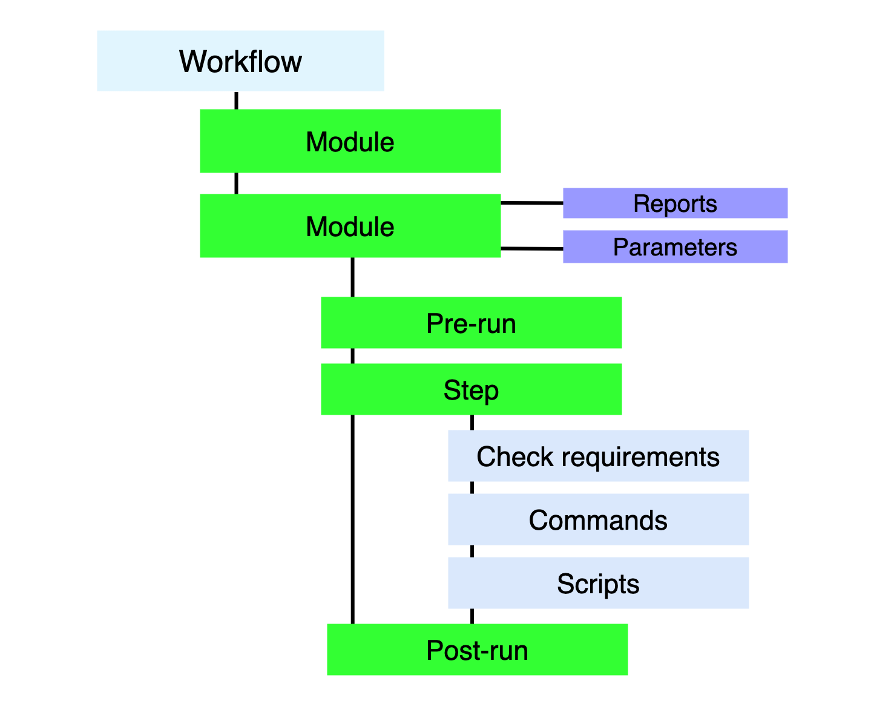

# :brain: Understand the workflow

Workflow is the core of the Osmedeus Engine which represents your methodology as YAML files.

{ loading=lazy }

!!! Warning "All Workflow files are YAML-based so make sure you follow the YAML syntax. Otherwise, it wouldn't work"

- **Module** contains detail of multiple step.
- **Flow** contains multiple module and also define order how to run these modules.
- **Step** is smallest part of the Osmedeus routine.

## Example Flow

### General flow

```yaml
name: general
desc: run normal routine
type: general # this is a folder name that will contains module file
validator: domain # validate the input provide from -t option

routines:
  - modules:
      - subdomain
  - modules:
      - probing
  - modules:
      - ssame
  - modules:
      - screenshot
  - modules: # these modules will be run in parallel
      - fingerprint
      - spider
      - sto
  - modules:  # these modules will be run in parallel
      - archive
      - ipspace
  - modules:
      - vulnscan
  - modules:
      - vhostscan
  - modules:
      - portscan
  - modules:
      - pdirbscan
  - modules:
      - dirbscan
  # push final result again
  - modules:
      - summary

```

### Flow with custom parameters

```yaml
name: gently-extensive
desc: run extensive routine but with very low threads
type: general
validator: domain
force-params: true

params:
  - subfinderThreads: "20"
  # probing
  - dnsThreads: "300"
  - httpThreads: "30"
  - massdnsRateBrute: "300"
  # screenshot
  - screenThreads: "8"
  # fingerprint & spider
  - ssthreads: "30"
  - overviewThreads: '30'
  - stoThreads: '30'
  - spiderThreads: "5"

  # vulnscan
  - nucleiThreads: "30"
  - jaelesThreads: "20"
  # dirbscan
  - ffThreads: '20' # threads for single ffuf-scan
  - dirbThreads: '2' # how many ffuf run at the same time
  # portscan
  - ports: "0-65535"
  - rateRustScan: "5000"
  - nmapThreads: "10"

routines:
  - flow: 'extensive'
    modules:
      - subdomain
  - flow: 'extensive'
    modules:
      - probing
  - flow: 'extensive'
    modules:
      - ssame
  - modules:
      - screenshot
  - modules:
      - sto
      - fingerprint
  - flow: 'extensive'
    modules:
      - spider
      - archive
  - modules:
      - ipspace
  - modules:
      - vulnscan
  # - modules:
  #     - vhostscan

  - modules:
      - portscan
  - flow: 'extensive'
    modules:
      - port-fingerprint
      - pvulnscan

  - flow: 'extensive'
    modules:
      - dirbscan
  # push final result again
  - modules:
      - summary

```

## Example Modules

### [subdomain module](https://github.com/osmedeus/osmedeus-workflow/blob/main/general/subdomain.yaml)
```yaml
name: subdomain
desc: Scanning for subdomain

report:
  final:
    - "{{Output}}/subdomain/final-{{Workspace}}.txt"
    - "{{Output}}/subdomain/more-{{Workspace}}.txt"

# {{Output}} == {{Workspaces}} + {{Workspace}} but strip "/" char
pre_run:
  - CreateFolder("{{Storages}}/subdomain/{{Workspace}}/")
  - CreateFolder("{{Storages}}/summary/{{Workspace}}/")
  - CreateFolder("{{Output}}/subdomain/")

params:
  - subthreads: "50"
  - amassTimeout: "3h"
  - amassConfig: "{{Data}}/amass-config/basic-config.yaml"

steps:
  - required:
      - "{{Binaries}}/amass"
      - "{{Binaries}}/subfinder"
      - "{{Binaries}}/assetfinder"
      - "{{Binaries}}/findomain"
    commands: # these two commands will run in parallels
      - "timeout -k 1m {{amassTimeout}} {{Binaries}}/amass enum -config {{amassConfig}} -silent -nocolor -d {{Target}} -o {{Output}}/subdomain/{{Workspace}}-raw-amass.txt > /dev/null 2>&1"
      - "{{Binaries}}/assetfinder -subs-only {{Target}} > {{Output}}/subdomain/{{Workspace}}-assetfinder.txt"
  # these two commands will run in parallels
  - commands:
      - "{{Binaries}}/findomain -u {{Output}}/subdomain/{{Workspace}}-findomain.txt -t {{Target}} > /dev/null 2>&1"
      - "{{Binaries}}/subfinder -d {{Target}} -t {{subthreads}} -o {{Output}}/subdomain/{{Workspace}}-subfinder.txt > /dev/null 2>&1"

  # cleaning some result
  - scripts:
      - Append("{{Output}}/subdomain/sum-{{Workspace}}.txt", "{{Output}}/subdomain/{{Workspace}}-amass.txt")
      - Append("{{Output}}/subdomain/sum-{{Workspace}}.txt", "{{Output}}/subdomain/{{Workspace}}-subfinder.txt")
      - Append("{{Output}}/subdomain/sum-{{Workspace}}.txt", "{{Output}}/subdomain/{{Workspace}}-assetfinder.txt")
      - Append("{{Output}}/subdomain/sum-{{Workspace}}.txt", "{{Output}}/subdomain/{{Workspace}}-findomain.txt")
      # remove junk subdomain like sample@subdomain.com and 1-2-3.subdomain.com format
      - ExecCmd("cat {{Output}}/subdomain/sum-{{Workspace}}.txt | {{Binaries}}/cleansub -t '{{Target}}' > {{Output}}/subdomain/final-{{Workspace}}.txt")
  - scripts:
      - SortU("{{Output}}/subdomain/final-{{Workspace}}.txt")

  # get more related domains
  - required:
      - "{{Binaries}}/metabigor"
    # assume you run 'osmedeus scan -t example.com' then {{Org}} == 'example'
    commands:
      - "echo '{{Org}}' | {{Binaries}}/metabigor cert --json -o {{Output}}/subdomain/more-json-{{Workspace}}.txt"
    scripts:
      - ExecCmd("cat {{Output}}/subdomain/more-json-{{Workspace}}.txt | jq -r '.Domain' | sed 's/\*.//g' | sort -u > {{Output}}/subdomain/more-{{Workspace}}.txt")

post_run:
  # delete all files in workspaces folder except a file lists in report section
  - Cleaning("{{Output}}/subdomain/")

```

***

### [dirbscan module](https://github.com/osmedeus/osmedeus-workflow/blob/main/general/dirbscan.yaml)

```yaml
name: dirbscan
desc: Run Dirbscan

report:
  final:
    - "{{Output}}/directory/beautify-{{Workspace}}.txt"
    - "{{Output}}/directory/beautify-{{Workspace}}.csv"

params:
  - httpFile: "{{Output}}/probing/http-{{Workspace}}.txt"
  - wordlists: "{{Data}}/wordlists/content/small.txt"
  - lines: "20"
  - ffThreads: '20' # threads for single site
  - dirbThreads: '10'
  - dlimit: '50000'
  - recursion: '0'
  - commitLength: '400'
  - chan: '#mics'
  - ffTimeout: '2h'
  - defaultUA: "User-Agent: Mozilla/5.0 (compatible; Osmedeus/v4; +https://github.com/j3ssie/osmedeus)"

pre_run:
  - CreateFolder("{{Output}}/directory")

steps:
  # check if the size is too big, We don't want tons of garbage here
  - conditions:
      - "FileLength('{{httpFile}}') > {{dlimit}}"
    scripts:
      - ErrPrintf("Filter", "Got input file greater than {{dlimit}} line")
      - Exit(1)

  - required:
      - "{{Binaries}}/ffuf"
      - "{{httpFile}}"
    source: "{{httpFile}}"
    threads: '{{dirbThreads}}'
    commands:
      - "{{Binaries}}/ffuf -t {{ffThreads}} -H '{{defaultUA}}' -s -timeout 15 -ac -fc '429,403,404' -D -e 'asp,aspx,pl,php,html,htm,jsp,cgi' -of json -o {{Output}}/directory/raw-[[._id_]].json -u '[[.line]]/FUZZ' -w {{wordlists}}:FUZZ >/dev/null 2>&1"

  # clean up and generate beautify report
  - scripts:
      - ExecCmd("awk '{print}' {{Output}}/directory/raw-*.json > {{Output}}/directory/summary-json-{{Workspace}}.txt")
      - CleanFFUFJson("{{Output}}/directory/summary-json-{{Workspace}}.txt", "{{Output}}/directory/beautify-{{Workspace}}.csv")
      - ExecCmd("cat {{Output}}/directory/beautify-{{Workspace}}.csv | {{Binaries}}/csvtk pretty --no-header-row -I -s ' | ' -W 75 > {{Output}}/directory/beautify-{{Workspace}}.txt")
      - TeleMessByFile("#dirb", "{{Output}}/directory/beautify-{{Workspace}}.txt")
      - Cat('{{Output}}/directory/beautify-{{Workspace}}.txt')

post_run:
  - TotalDirb("{{Output}}/directory/beautify-{{Workspace}}.txt")

```


## Step

Here are three different steps for running commands and scripts.

### Normal Step

```yaml
steps: # all the steps will run in serial
  - commands: # unix command and it will be run in parallel
      - "unix command 1 here"
      - "unix command 2 here"
    scripts: 
      - ExecCmd("unix command 3 heret") # command 3 and 4 below it will be run in serial
      - ExecCmd("unix command 4 here")
      - SortU("filename-here.txt")
```

### Step with conditions

```yaml
steps: # all the steps will run in serial
  - required: # Check if all the files exist or the step will not run
      - filename-1-here.txt
    conditions: # Boolean conditions check with built-in scripts
      - "FileLength('filename.txt') > 10000"
      - Exit(1) # this will exit the module imeediately
    commands: # unix command and it will be run in parallel
      - "unix command 1 here"
      - "unix command 2 here"
    scripts: 
      - ExecCmd("unix command 3 heret") # command 3 and 4 below it will be run in serial
      - ExecCmd("unix command 4 here")
      - SortU("filename-here.txt")
      - TeleMessByFile("#dirb", "beautify-{{Workspace}}.txt")

- required: # Check if all the files exist or the step will not run
      - filename-2-here.txt
    conditions: # Boolean conditions check with built-in scripts
      - "FileLength('filename-2-here.txt') > 10000"
    ## only run if conditions is false
    rcommands: # run in parallel
      - "unix command 1 here"
      - "unix command 2 here"
    rscripts:
      - ErrPrintf("Filter", "Got input file greater than 1000 line")
      - Exit(1) # this will exit the module imeediately

```


### Step with the loop using `source:` tag and `[[.line]]` variable.

```yaml

steps:
 # variation 2 that will run the step but with input is each like of 'source' section
  - source: "{{inputFile}}" # source file to loop through
    threads: '{{dirbThreads}}'
    commands: # {{Binaries}} is the path to binaries which usually ~/osmedeus/binaries/ but you can use any tool inside your $PATH environment variable
      - "{{Binaries}}/ffuf-mod -H 'X-Forwarded-For: 127.0.0.1' -t {{fthreads}} -recursion-depth {{recursion}} -D -e 'asp,aspx,php,html,htm,jsp,cgi' -timeout 15 -get-hash -ac -s -fc '429,404,400' -of json -o {{Output}}/directory/raw-[[._id_]].json -u '[[.line]]/FUZZ' -w {{wordlists}}:FUZZ"
    scripts:
      - SortU("{{Storages}}/paths/{{Workspace}}/paths-{{Workspace}}.csv")

```
